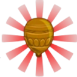

<h1 align="center">BloonAdjustment</h1>

Jericho in btdb2 has a bloon adjustment ability, which will make a few bloons have camo, regrow, or fortified bloons, or might even promote them to a higher rank. What if that feature is in BTD6? Well then... (ALSO BEFORE YOU DOWNLOAD, THIS MOD ADDS ALOT OF BLOON GROUPS TO THE GAMEMODE SO IT WILL TAKE A WHILE TO LOAD)

